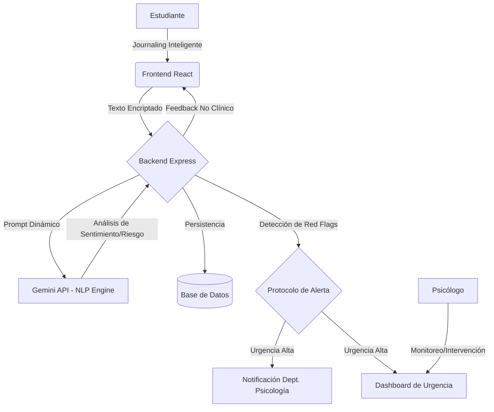

# Documento de Especificación Técnica: Mentis

## 1. Visión General
Mentis es una plataforma HealthTech diseñada para la detección temprana de riesgos socioemocionales en la población universitaria. Utiliza el **Modelo Biopsicosocial** y **Procesamiento de Lenguaje Natural (NLP)** para analizar el estado emocional de los estudiantes a través de un sistema de "Journaling Inteligente".

## 2. Diagrama de Flujo de Datos

## 3. Lista de Funcionalidades Clave (MVP)
- **Journaling Inteligente**: Interfaz de escritura con prompts dinámicos que cambian según el estado de ánimo detectado.
- **Motor de Análisis NLP**: Integración con Gemini para detectar:
    - Sentimiento (Positivo, Neutro, Negativo).
    - Urgencia (Baja, Media, Alta, Crítica).
    - Distorsiones Cognitivas (Catastrofismo, Pensamiento Todo o Nada, etc.).
- **Protocolo de Red Flags**: Bloqueo de flujo y activación de alerta inmediata si se detectan ideaciones autolíticas o riesgo vital.
- **Dashboard Clínico**: Visualización de tendencias, mapas de calor emocional y gestión de casos para profesionales de bienestar.
- **Privacidad de Datos**: Cifrado end-to-end y cumplimiento con estándares HIPAA/GDPR.

## 4. Estructura de la Base de Datos (Entidades)
- **Estudiante**: `id`, `nombre`, `carrera`, `año`, `nivel_riesgo_actual`.
- **Entrada (Journal Entry)**: `id`, `estudiante_id`, `contenido_original`, `fecha`, `analisis_nlp_id`.
- **Análisis NLP**: `id`, `sentimiento`, `puntuación_urgencia`, `distorsiones_detectadas`, `resumen_clinico`.
- **Alerta**: `id`, `estudiante_id`, `nivel`, `estado` (Abierta, En Proceso, Cerrada), `psicologo_asignado_id`.
- **Informe**: `id`, `estudiante_id`, `fecha_generacion`, `tendencia_mensual`.

## 5. Diseño de la API de Análisis (Endpoints)
- `POST /api/journal/analyze`: Recibe el texto del estudiante, retorna el análisis preliminar y activa alertas si es necesario.
- `GET /api/psychologist/dashboard`: Retorna la lista de estudiantes filtrada por nivel de riesgo.
- `GET /api/psychologist/alerts`: Retorna alertas activas sin resolver.
- `POST /api/alerts/{id}/resolve`: Permite al psicólogo marcar una intervención como completada.

## 6. Stack Tecnológico Recomendado
- **Frontend**: React + Tailwind CSS + Framer Motion (para una experiencia de usuario fluida y empática).
- **Backend**: Node.js (Express) + TypeScript.
- **IA**: Gemini API (Google GenAI) para análisis de texto avanzado.
- **Base de Datos**: Firestore (NoSQL) para escalabilidad y tiempo real.
- **Seguridad**: Auth0 o Firebase Auth + Cifrado AES-256 para el contenido de los diarios.
